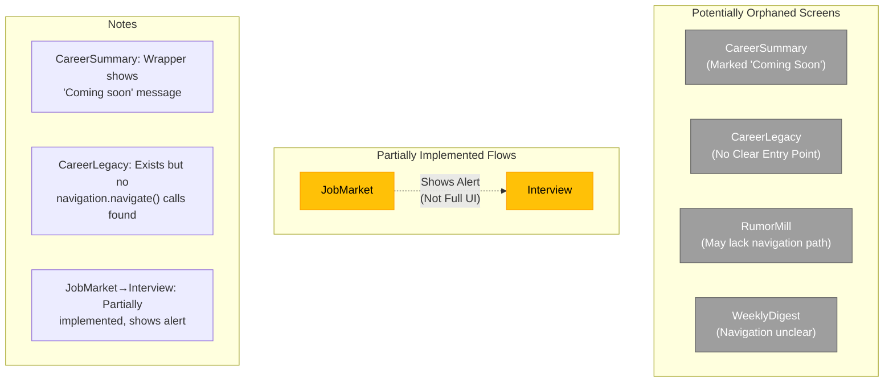
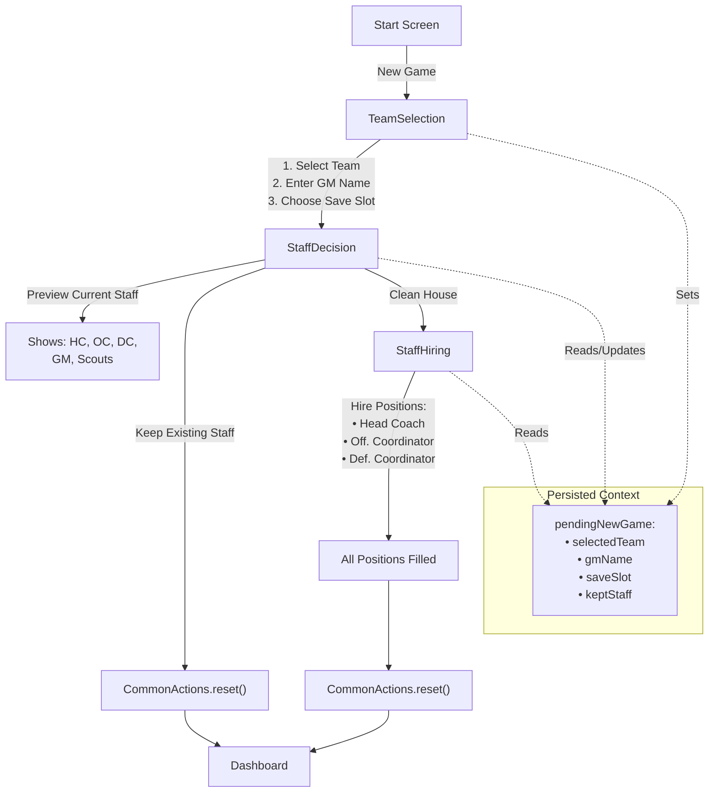
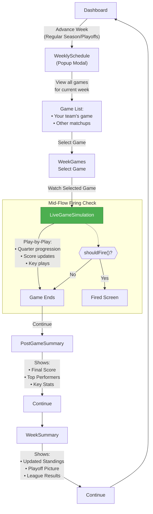
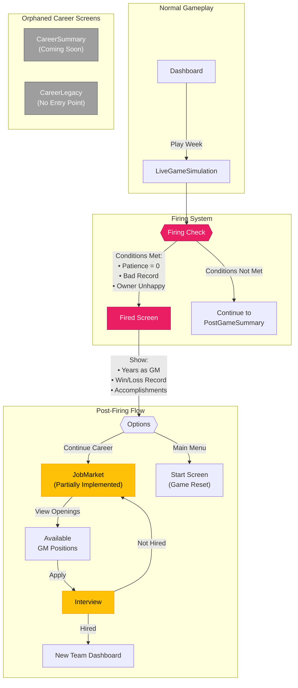

# NFL GM Simulator - Application Flow Diagram

This document contains Mermaid diagrams showing all screen navigation flows, logical branches, and orphaned screens in the application.

## Complete Application Flow

```mermaid
flowchart TD
    subgraph Entry["Entry Point"]
        Start["Start Screen<br/>(Initial Route)"]
    end

    subgraph PreGame["Pre-Game Setup"]
        TeamSelection["TeamSelection<br/>Choose Team & GM Name"]
        StaffDecision["StaffDecision<br/>Keep Staff or Clean House"]
        StaffHiring["StaffHiring<br/>Hire New Coaches"]
        Settings["Settings<br/>Game Preferences"]
    end

    subgraph MainHub["Main Game Hub"]
        Dashboard["Dashboard<br/>(Central Hub)"]
    end

    subgraph WeekProgression["Week/Season Progression"]
        WeeklySchedule["WeeklySchedule<br/>Select Week's Games"]
        WeekGames["WeekGames<br/>Choose Game to Watch"]
        LiveGameSimulation["LiveGameSimulation<br/>Play-by-Play Simulation"]
        PostGameSummary["PostGameSummary<br/>Game Results"]
        WeekSummary["WeekSummary<br/>Standings Update"]
        WeeklyDigest["WeeklyDigest<br/>Weekly News"]
    end

    subgraph RosterManagement["Roster & Depth Chart"]
        Roster["Roster<br/>Team Roster"]
        DepthChart["DepthChart<br/>Player Positioning"]
        PlayerProfile["PlayerProfile<br/>Player Details"]
        Trade["Trade<br/>Trade Proposals"]
    end

    subgraph DraftScreens["Draft System"]
        DraftBoard["DraftBoard<br/>Prospect Board"]
        DraftRoom["DraftRoom<br/>Active Draft"]
        ProspectDetail["ProspectDetail<br/>Prospect Profile"]
        Combine["Combine<br/>Combine Results"]
    end

    subgraph ScoutingScreens["Scouting"]
        ScoutingReports["ScoutingReports<br/>Scout Evaluations"]
        BigBoard["BigBoard<br/>Team Needs vs Prospects"]
    end

    subgraph FreeAgencyScreens["Free Agency"]
        FreeAgency["FreeAgency<br/>Available Free Agents"]
        RFA["RFA<br/>Restricted Free Agency"]
        CompPickTracker["CompPickTracker<br/>Compensatory Picks"]
    end

    subgraph CoachingScreens["Coaching Staff"]
        Staff["Staff<br/>Current Coaching Staff"]
        CoachProfile["CoachProfile<br/>Coach Details"]
        CoachHiring["CoachHiring<br/>Hire New Coaches"]
        CoachingTree["CoachingTree<br/>Coach Lineage"]
    end

    subgraph OffseasonScreens["Offseason"]
        Offseason["Offseason<br/>Task Management"]
        SeasonRecap["SeasonRecap<br/>Season Summary"]
        OTAs["OTAs<br/>Team Activities"]
        TrainingCamp["TrainingCamp<br/>Training Phase"]
        Preseason["Preseason<br/>Preseason Games"]
        FinalCuts["FinalCuts<br/>Roster Reduction"]
    end

    subgraph TeamManagement["Team Management"]
        Schedule["Schedule<br/>Season Schedule"]
        Standings["Standings<br/>League Standings"]
        PlayoffBracket["PlayoffBracket<br/>Playoff Bracket"]
        Finances["Finances<br/>Salary Cap"]
        ContractManagement["ContractManagement<br/>Contracts"]
    end

    subgraph OwnerNews["Owner Relations & News"]
        OwnerRelations["OwnerRelations<br/>Owner Satisfaction"]
        News["News<br/>Team/League News"]
        RumorMill["RumorMill<br/>Trade Rumors"]
        Stats["Stats<br/>Statistics"]
    end

    subgraph CareerScreens["Career System"]
        CareerSummary["CareerSummary<br/>Career Stats"]
        Fired["Fired<br/>GM Firing"]
        JobMarket["JobMarket<br/>Available Positions"]
        Interview["Interview<br/>Team Interview"]
        CareerLegacy["CareerLegacy<br/>Legacy Summary"]
    end

    %% Entry Flow
    Start -->|"New Game"| TeamSelection
    Start -->|"Continue"| Dashboard
    Start -->|"Settings"| Settings
    Settings -->|"goBack"| Start

    %% New Game Setup Flow
    TeamSelection -->|"Select Team"| StaffDecision
    StaffDecision -->|"Keep Staff"| Dashboard
    StaffDecision -->|"Clean House"| StaffHiring
    StaffHiring -->|"Complete Hiring"| Dashboard

    %% Dashboard to All Major Screens
    Dashboard -->|"roster"| Roster
    Dashboard -->|"depthChart"| DepthChart
    Dashboard -->|"schedule"| Schedule
    Dashboard -->|"stats"| Stats
    Dashboard -->|"bigBoard"| BigBoard
    Dashboard -->|"freeAgency"| FreeAgency
    Dashboard -->|"staff"| Staff
    Dashboard -->|"finances"| Finances
    Dashboard -->|"contracts"| ContractManagement
    Dashboard -->|"news"| News
    Dashboard -->|"offseason"| Offseason
    Dashboard -->|"ownerRelations"| OwnerRelations
    Dashboard -->|"settings"| Settings

    %% Conditional: Standings vs PlayoffBracket
    Dashboard -->|"standings<br/>(if playoffs)"| PlayoffBracket
    Dashboard -->|"standings<br/>(else)"| Standings

    %% Conditional: Draft Board vs Room
    Dashboard -->|"draft<br/>(if offseasonPhase=7)"| DraftRoom
    Dashboard -->|"draft<br/>(else)"| DraftBoard

    %% Week Progression Flow
    Dashboard -->|"advanceWeek<br/>(regularSeason/playoffs)"| WeeklySchedule
    WeeklySchedule -->|"Select Games"| WeekGames
    WeekGames -->|"Watch Game"| LiveGameSimulation
    LiveGameSimulation -->|"Game Complete"| PostGameSummary
    PostGameSummary -->|"Continue"| WeekSummary
    WeekSummary -->|"Continue"| Dashboard
    Dashboard -->|"viewWeekSummary"| WeekSummary

    %% Roster Sub-flows
    Roster -->|"View Player"| PlayerProfile
    Roster -->|"Trade"| Trade
    Trade -->|"goBack"| Roster
    PlayerProfile -->|"goBack"| Roster

    %% Draft Sub-flows
    DraftBoard -->|"View Prospect"| ProspectDetail
    DraftBoard -->|"Combine"| Combine
    DraftRoom -->|"View Prospect"| ProspectDetail
    ProspectDetail -->|"goBack"| DraftBoard

    %% Scouting Flows
    BigBoard -->|"View Prospect"| PlayerProfile
    ScoutingReports -->|"goBack"| Dashboard

    %% Free Agency Flows
    FreeAgency -->|"View Player"| PlayerProfile
    RFA -->|"View Player"| PlayerProfile

    %% Coaching Flows
    Staff -->|"View Coach"| CoachProfile
    Staff -->|"Hire Coach"| CoachHiring
    CoachProfile -->|"goBack"| Staff
    CoachHiring -->|"View Tree"| CoachingTree
    CoachingTree -->|"View Coach"| CoachProfile

    %% Offseason Task Navigation
    Offseason -->|"Draft Tasks"| DraftBoard
    Offseason -->|"Draft (Phase 7)"| DraftRoom
    Offseason -->|"Scouting"| ScoutingReports
    Offseason -->|"Big Board"| BigBoard
    Offseason -->|"Free Agency"| FreeAgency
    Offseason -->|"RFA"| RFA
    Offseason -->|"Comp Picks"| CompPickTracker
    Offseason -->|"OTAs"| OTAs
    Offseason -->|"Training"| TrainingCamp
    Offseason -->|"Preseason"| Preseason
    Offseason -->|"Final Cuts"| FinalCuts
    Offseason -->|"Season Recap"| SeasonRecap
    Offseason -->|"Owner"| OwnerRelations
    Offseason -->|"Staff"| Staff
    Offseason -->|"Finances"| Finances
    Offseason -->|"Contracts"| ContractManagement
    Offseason -->|"Roster"| Roster

    %% Career/Firing Flow
    LiveGameSimulation -->|"Firing Triggered<br/>(patience/record check)"| Fired
    Fired -->|"Continue"| JobMarket
    Fired -->|"Main Menu"| Start
    JobMarket -->|"Apply"| Interview
    Interview -->|"Hired"| Dashboard
    Interview -->|"goBack"| JobMarket

    %% Return to Dashboard (goBack patterns)
    Schedule -->|"goBack"| Dashboard
    Standings -->|"goBack"| Dashboard
    PlayoffBracket -->|"goBack"| Dashboard
    Stats -->|"goBack"| Dashboard
    BigBoard -->|"goBack"| Dashboard
    FreeAgency -->|"goBack"| Dashboard
    RFA -->|"goBack"| Dashboard
    CompPickTracker -->|"goBack"| Dashboard
    Staff -->|"goBack"| Dashboard
    Finances -->|"goBack"| Dashboard
    ContractManagement -->|"goBack"| Dashboard
    News -->|"goBack"| Dashboard
    OwnerRelations -->|"goBack"| Dashboard
    Offseason -->|"goBack"| Dashboard
    DepthChart -->|"goBack"| Dashboard
    DraftBoard -->|"goBack"| Dashboard
    DraftRoom -->|"goBack"| Dashboard
    OTAs -->|"goBack"| Offseason
    TrainingCamp -->|"goBack"| Offseason
    Preseason -->|"goBack"| Offseason
    FinalCuts -->|"goBack"| Offseason
    SeasonRecap -->|"goBack"| Offseason

    %% Styling
    classDef entryPoint fill:#4CAF50,stroke:#2E7D32,color:#fff
    classDef hub fill:#2196F3,stroke:#1565C0,color:#fff
    classDef conditional fill:#FF9800,stroke:#EF6C00,color:#fff
    classDef orphaned fill:#9E9E9E,stroke:#616161,color:#fff
    classDef career fill:#E91E63,stroke:#AD1457,color:#fff

    class Start entryPoint
    class Dashboard hub
    class PlayoffBracket,DraftRoom conditional
    class CareerSummary,CareerLegacy orphaned
    class Fired,JobMarket,Interview career
```

## Conditional Navigation Branches

```mermaid
flowchart TD
    subgraph StandingsCondition["Standings Navigation"]
        D1["Dashboard"]
        D1 -->|"Check: calendar.currentPhase"| C1{Phase?}
        C1 -->|"playoffs"| PB["PlayoffBracket"]
        C1 -->|"other"| ST["Standings"]
    end

    subgraph DraftCondition["Draft Navigation"]
        D2["Dashboard"]
        D2 -->|"Check: offseasonPhase"| C2{Phase = 7?}
        C2 -->|"Yes (Draft Active)"| DR["DraftRoom"]
        C2 -->|"No"| DB["DraftBoard"]
    end

    subgraph WeekAdvanceCondition["Week Advance Navigation"]
        D3["Dashboard"]
        D3 -->|"advanceWeek"| C3{Phase?}
        C3 -->|"regularSeason/playoffs"| WS["WeeklySchedule"]
        C3 -->|"offseason/preseason"| SIM["Direct Simulation<br/>(No UI)"]
        SIM --> D3
    end

    subgraph FiringCondition["Firing Check"]
        LGS["LiveGameSimulation"]
        LGS -->|"Week Complete"| C4{shouldFire?}
        C4 -->|"Yes<br/>(patience=0, bad record)"| F["Fired Screen"]
        C4 -->|"No"| PGS["PostGameSummary"]
    end

    classDef condition fill:#FF9800,stroke:#EF6C00,color:#fff
    class C1,C2,C3,C4 condition
```

## Orphaned / Potentially Unreachable Screens

## New Game Setup Flow (Detailed)

## Week Progression Flow (Detailed)

## Offseason Task Flow

```mermaid
flowchart TD
    OFF["Offseason Screen<br/>(12 Phases)"]

    subgraph Phase1["Phase 1-2: End of Season"]
        SR["SeasonRecap"]
        OR["OwnerRelations"]
    end

    subgraph Phase3_4["Phase 3-4: Free Agency Prep"]
        CT["CompPickTracker"]
        FA["FreeAgency"]
        RFA_S["RFA"]
    end

    subgraph Phase5_6["Phase 5-6: Draft Prep"]
        SC["ScoutingReports"]
        BB["BigBoard"]
        CMB["Combine"]
        DB["DraftBoard"]
    end

    subgraph Phase7["Phase 7: Draft"]
        DR["DraftRoom"]
    end

    subgraph Phase8_10["Phase 8-10: Post-Draft"]
        OTA["OTAs"]
        TC["TrainingCamp"]
        PS["Preseason"]
    end

    subgraph Phase11_12["Phase 11-12: Final Prep"]
        FC["FinalCuts"]
        ROS["Roster"]
        DEP["DepthChart"]
    end

    subgraph AlwaysAvailable["Always Available"]
        STF["Staff"]
        FIN["Finances"]
        CON["ContractManagement"]
    end

    OFF --> Phase1
    OFF --> Phase3_4
    OFF --> Phase5_6
    OFF --> Phase7
    OFF --> Phase8_10
    OFF --> Phase11_12
    OFF --> AlwaysAvailable

    SR -->|"goBack"| OFF
    OR -->|"goBack"| OFF
    CT -->|"goBack"| OFF
    FA -->|"goBack"| OFF
    RFA_S -->|"goBack"| OFF
    SC -->|"goBack"| OFF
    BB -->|"goBack"| OFF
    CMB -->|"goBack"| OFF
    DB -->|"goBack"| OFF
    DR -->|"goBack"| OFF
    OTA -->|"goBack"| OFF
    TC -->|"goBack"| OFF
    PS -->|"goBack"| OFF
    FC -->|"goBack"| OFF
    ROS -->|"goBack"| OFF
    DEP -->|"goBack"| OFF
    STF -->|"goBack"| OFF
    FIN -->|"goBack"| OFF
    CON -->|"goBack"| OFF
```

## Career/Firing System Flow

## Screen Summary Table

| Category | Screens | Count |
|----------|---------|-------|
| Entry/Settings | Start, Settings | 2 |
| New Game Setup | TeamSelection, StaffDecision, StaffHiring | 3 |
| Main Hub | Dashboard | 1 |
| Week Progression | WeeklySchedule, WeekGames, LiveGameSimulation, PostGameSummary, WeekSummary, WeeklyDigest | 6 |
| Roster Management | Roster, DepthChart, PlayerProfile, Trade | 4 |
| Draft | DraftBoard, DraftRoom, ProspectDetail, Combine | 4 |
| Scouting | ScoutingReports, BigBoard | 2 |
| Free Agency | FreeAgency, RFA, CompPickTracker | 3 |
| Coaching | Staff, CoachProfile, CoachHiring, CoachingTree | 4 |
| Offseason | Offseason, SeasonRecap, OTAs, TrainingCamp, Preseason, FinalCuts | 6 |
| Team Management | Schedule, Standings, PlayoffBracket, Finances, ContractManagement | 5 |
| Owner/News | OwnerRelations, News, RumorMill, Stats | 4 |
| Career | CareerSummary, Fired, JobMarket, Interview, CareerLegacy | 5 |
| **Total** | | **49** |

## Conditional Navigation Summary

| Condition | Check | True Route | False Route |
|-----------|-------|------------|-------------|
| Standings/Playoffs | `calendar.currentPhase === 'playoffs'` | PlayoffBracket | Standings |
| Draft Access | `calendar.offseasonPhase === 7` | DraftRoom | DraftBoard |
| Week Advance | `phase in ['regularSeason', 'playoffs']` | WeeklySchedule | Direct Sim |
| GM Firing | `shouldFire(patience, record, owner)` | Fired Screen | Continue Game |

## Orphaned Screens Summary

| Screen | Status | Notes |
|--------|--------|-------|
| CareerSummary | Orphaned | Shows "Coming soon" wrapper |
| CareerLegacy | Orphaned | No navigation calls found |
| RumorMill | Potentially Orphaned | Navigation path unclear |
| WeeklyDigest | Potentially Orphaned | May not be navigated to |
| JobMarket | Partially Implemented | Shows alert instead of full UI |
| Interview | Partially Implemented | Part of incomplete career flow |
